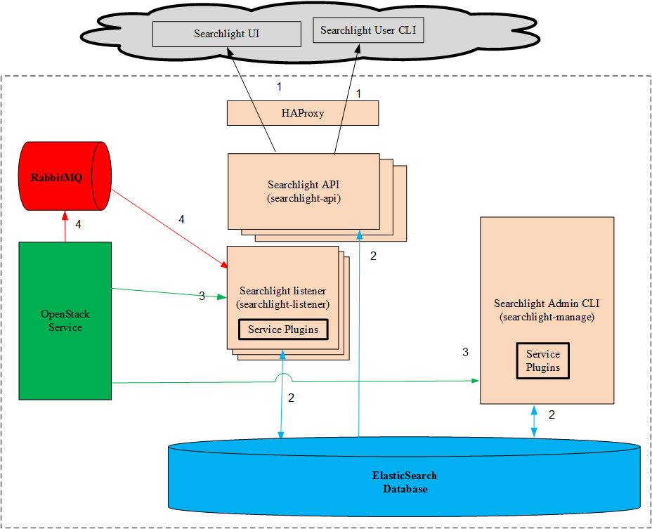
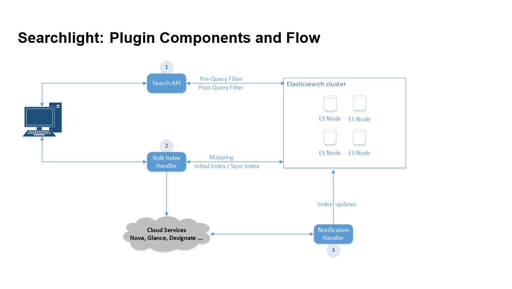
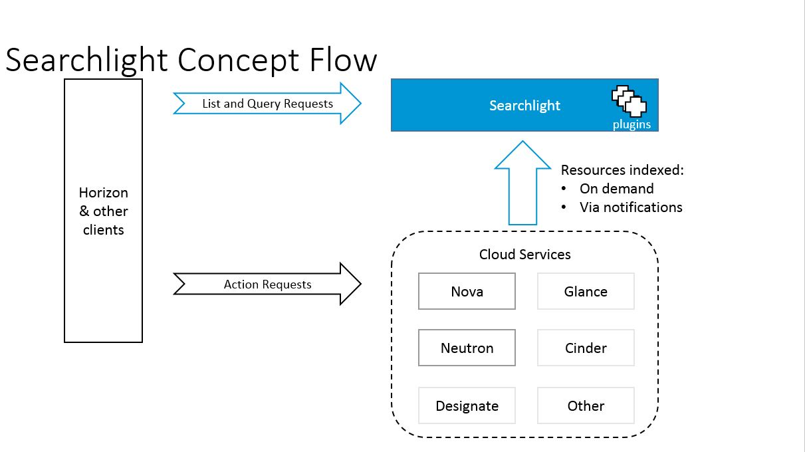
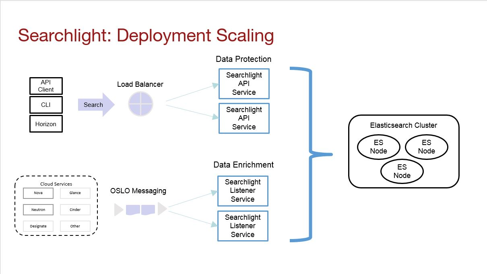

..
      Copyright (c) 2016 Hewlett Packard Enterprise Development LP
      All Rights Reserved.

      Licensed under the Apache License, Version 2.0 (the "License"); you may
      not use this file except in compliance with the License. You may obtain
      a copy of the License at

          http://www.apache.org/licenses/LICENSE-2.0

      Unless required by applicable law or agreed to in writing, software
      distributed under the License is distributed on an "AS IS" BASIS, WITHOUT
      WARRANTIES OR CONDITIONS OF ANY KIND, either express or implied. See the
      License for the specific language governing permissions and limitations
      under the License.

Searchlight Architecture
========================

The OpenStack Search Service
----------------------------

Searchlight is a microservice based architecture that provides advanced and
multi-tenant searching capabilities across multiple cloud services through
indexing into Elasticsearch. Once indexed, users are able to search through
all internal data associated with an OpenStack service through a single API
with a consistent interface. These searches can be quite complex, are blazingly
fast, and easily paginated.  Without Searchlight it can be necessary to make
calls to multiple services to retrieve resource information.

All documents in Elasticsearch are protected by Searchlight with role-based
access control (RBAC) for data security and protection. RBAC protection
prevents unauthorized users from accessing data that they are not permitted to
view. Searchlight uses RBAC in three ways to protect the data:

  1. **Network Restriction:** Elasticsearch is not directly accessible. It
     resides on a restricted network behind Searchlight. The only way to access
     the data within Elasticsearch is indirectly through the Searchlight.
     API endpoints. Users need to be authenticated to access these endpoints.
  2. **Document Separation:** Each resource is indexed twice in Elasticsearch.
     Once for the admin user and once for all others. The document associated
     with the admin has all fields present. The document associated with
     non-admins has all admin-only fields removed. This model prevents a
     non-admin from viewing any admin-only fields since these fields are not
     present in the document at all.
  3. **Pre-Query Protection:** Searchlight will inject RBAC-based protection
     into all queries before they get sent to Elasticsearch. In general the
     pre-query RBAC injection will provide gross level protection. For example,
     entire projects that the user does not have access to. See Figure 2.
  4. **Post-Query Protection:** Searchlight uses the RBAC-based protection to
     filter the response to each query in order to remove any sensitive data
     before returning the results to the eagerly waiting user. In general the
     post-query RBAC filtering will provide fine level protection. For example,
     specific fields within a document. See Figure 2.

The functionality provided by Searchlight differs greatly from the logging
capabilities of OpenStack. The logging services store predetermined messages
from the OpenStack services, as opposed to the dynamic, internal state of the
OpenStack services.

Primary Users
-------------

The primary users are Horizon-based. This includes users accessing their
cloud projects ("tenants") and cloud administrators (IT operations).

Searchlight Components
----------------------

Searchlight consists of multiple components. The components live in one of two
environments: externally on the end-user's system or internally on an
OpenStack deployed system. Figure 1 illustrates how all of these components
interact.

**Figure 1: Architecture Diagram**

Figure 1 shows the relationship between all of the Searchlight components. The
external Searchlight components are colored light-grey. The internal
Searchlight components are colored peach. The internal non-Searchlight
components are brightly colored, as are the arrows indicating the interfaces
for these components.

* **Searchlight UI:** A plugin for Horizon that provides search support. Lives
  externally on the end-user's system.
* **Searchlight User CLI (OpenStack Client plugin):** Command-line interface
  to the Searchlight API. Lives externally on the end-user's system.
* **Searchlight API:** OpenStack Searchlight RESTful API. A separate process
  running a WSGI web server on top of the python Searchlight framework. All
  external access (for example, Horizon, browser, and CLI) go through the
  Searchlight API. The Searchlight API performs read-only accesses of
  Elasticsearch.
* **HAProxy:** High availability load balancer and proxy server for the
  Searchlight API component. HAProxy enables multiple instances of the
  Searchlight API to run and allows for better performance, scalability, and
  reliability of the Searchlight service.
* **Searchlight Listener:** A separate Searchlight process that is plugged
  into the notification MQ for the OpenStack services. Whenever there is a
  change in state for a resource type in an OpenStack service, a notification
  is sent to the Searchlight Listener. This results in the OpenStack service
  state being indexed into Elasticsearch as a document related to that
  resource type (for example, OS::Nova::Server). The listener is never accessed
  directly by any of the other Searchlight components.
* **Searchlight Admin CLI (searchlight-manage):** A separate process that
  provides admin support for Searchlight. The main functionality is
  re-indexing support. Connects to various OpenStack services and loads data
  from them into the Elasticsearch indices. The admin needs to log in directly
  to a Searchlight node and run the Searchlight Admin CLI from that node. The
  Searchlight Admin CLI performs read/write accesses to Elasticsearch. Lives
  internally on an OpenStack deployed system.
* **Elasticsearch:** A database service used to index information about
  selected services. Elasticsearch is meant to be shared by multiple OpenStack
  projects, not just Searchlight. This implies that there may be multiple
  indices within Elasticsearch. All Elasticsearch indices used by Searchlight
  are created in a way so as to be unique to Searchlight. This will prevent
  any duplication between Searchlight and other OpenStack projects that may
  be sharing Elasticsearch. Lives internally on an OpenStack deployed system.
* **RabbitMQ:** Messaging Queue used for accessing the OpenStack's OSLO
  notification MQ. Each OpenStack service will place notifications for any
  state change in RabbitMQ. The Searchlight listener will pull this
  notifications from RabbitMQ and process them. Lives internally on an
  OpenStack deployed system. All access of the notification MQ is done
  through OSLO messaging.
* **OpenStack Services:** Various OpenStack Services from which Searchlight
  gathers information through internal plugins. The current list of supported
  OpenStack services are: Cinder, Designate, Glance, Neutron, Nova, Swift.
  Searchlight accesses the services as an admin, not as a regular user.
  This admin access is required for the extra privileges that are needed,
  for example, to access objects across projects ("tenants"). The credentials
  for the admin are stored in the config files.
* **OpenStack Service Plugins:** Each OpenStack service mentioned above has
  one or more associated plugins. These plugins live in Searchlight and not in
  the OpenStack service. The plugins are based on a resource type and not on
  the OpenStack service. For example, the Cinder Service has two resource types
  used by Searchlight: OS::Cinder::Volume and OS::Cinder::Snapshot. This
  results in two plugins for the Cinder service. The architecture is the same
  for each plugin. The plugins are not a separate process. The plugins live
  within the Searchlight listener and the Searchlight Admin CLI components.

The numbered arrows represent the interfaces between the components. These
interfaces are fully described in Table 1.

Searchlight Eco-System
----------------------

The Searchlight Eco-system is illuminated by Figure 2. We will step through
each stage of the Searchlight life-cycle to further explore how the various
components interact with each other.

**Deployment Stage:** This stage is when Searchlight gets instantiated by the
admin dev ops. Even though the steps are mentioned as if they are manual steps,
they are all done within a deployment process. More deployment stage options
are discussed in Figure 4.

1. The OpenStack services (for example, Nova, Neutron) are started. These
   services are used by Searchlight, but are not a part of the Searchlight
   Eco-system. The admin will set up the configuration files for all services
   that are used by Searchlight, including enabling the notifications that will
   later be consumed by Searchlight.

2. Elasticsearch is started. This analytics engine is used by Searchlight, but
   it is not a part of the Searchlight Eco-system. As a note, other services
   may also be using Elasticsearch.

3. The admin sets up the Searchlight configuration file.

4. The initial indexing for Searchlight occurs (component 2 in Figure 2). This
   happens when the admin runs the command ``searchlight-manage index sync`` on
   a Searchlight node. Searchlight will pull the data from the OpenStack
   service's API and index it into Elasticsearch.

5. The Searchlight listeners are started (component 3 in Figure 2). This
   happens when the admin runs the command ``searchlight-listener`` At this
   point, Searchlight is notified of any state changes that occurs in the
   services. The OpenStack services will push the data to Searchlight, which
   in turn will index that data into Elasticsearch.

6. The Searchlight API service is started (component 1 in Figure 2). This
   happens when the admin runs the command ``searchlight-api`` At this point,
   the Searchlight API is live and anyone can start making queries to
   Searchlight.

**Running Stage (automatic):** This stage consumes the vast majority of the
Searchlight life cycle. The running stage is further highlighted in Figure 3.

1. The Searchlight listeners are actively receiving notifications from the
   OpenStack services whenever there is a state change.

2. The Searchlight API service is actively receiving queries from Horizon apps
   and users.

**Maintenance Stage (manual):** This stage occurs when the admin needs to
analyze the state of Searchlight Eco-system or make corrections to it.

1. To verify there are no orphaned Elasticsearch indices, the admin can view
   the Elasticsearch indices being used by Searchlight using the
   ``searchlight-manage`` command. Any orphaned indices will be taken
   care of through Elasticsearch and not through Searchlight.
   See :ref:`ES-Index-Cleanup`.

2. If the Elasticsearch data is no longer coherent with the OpenStack
   services, the admin will need to re-index Elasticsearch. This is done by
   running the command ``searchlight-manage`` similarly to step 4 in
   the deployment stage. See :ref:`ES-Bulk-Indexing`.

**Figure 2: Searchlight Eco-System**

Searchlight Flow
----------------

The main portion of the Eco-system, the running stage, is showcased in Figure
3. The diagram is from the viewpoint of the users of the Eco-system.

The clients will access the OpenStack services. This could include issuing
commands to create a new server, delete a volume or modify a networking subnet.
The commands can be sent directly to the OpenStack service's API or indirectly
through the Horizon dashboard. Once these commands are executed by the
OpenStack services, the OpenStack services will notify Searchlight of the
resulting state changes.

Simultaneously, the user can make queries of Searchlight to better understand
the entire OpenStack Eco-system. These queries can be made directly through the
Searchlight API or indirectly through the Horizon dashboard.

**Figure 3: Searchlight Flow**

Searchlight Scaling
-------------------

When deploying Searchlight, the Eco-system is scaled in multiple ways. This
scaling is done for both performance and reliability. Both the Searchlight API
and the Searchlight listener are stateless microservices. This makes it easier
to scale them. Figure 4 shows this in glorious color.

Searchlight API Services:

* Multiple instances of the Searchlight API service can be deployed and placed
  behind a load balancer. The load balancer hides the details of the
  Searchlight API services from the user. All user API access will go through
  the load balancer. In addition, the WSGI web service has multiple threads
  handling all requests.

Searchlight Listeners:

* There are multiple notification workers that are receiving messages from the
  OpenStack services. The number of workers can be statically specified in the
  Searchlight configuration file. In addition, each type of resource indexed by
  Searchlight can be scaled independently by spawning different processes with
  different configuration files.

Elasticsearch:

* Elasticsearch is deployed with multiple nodes in a cluster. Each cluster can
  also have multiple shards and replicas. The number of nodes, shards and
  replicas are specified in the Elasticsearch configuration file. But the
  number of shards and replicas can be overwritten on a per-index basis by
  Searchlight. See :ref:`Indexing-Model`

**Figure 4: Searchlight Scaling**

Component Interfaces
--------------------

Tables 1 and 2 provide more details with the interfaces in Figure 1. These
details are geared toward understanding the security model and analyzing
potential threats for Searchlight.

**Table 1: Interfaces**

=========  ================  =====================   ====================  ===================  ======================  =================  ===================  ====================  =====================================
Interface  Network protocol  Requestor               Request               Request credentials  Request authorization   Listener           Response             Response credentials  Description of operation
=========  ================  =====================   ====================  ===================  ======================  =================  ===================  ====================  =====================================
1          HTTPS             Searchlight UI          Horizon Searches      Session token        Admin or User           Searchlight API    Search results       TLS Certificate       Search query from Horizon.
1          HTTPS             Searchlight User CLI    User Searches         Session token        Admin or User           Searchlight API    Search results       TLS Certificate       Search query form user.
2          HTTP              Searchlight API         Query                 None                 None                    Elasticsearch      Query Results        None                  Elasticsearch access to
                                                                                                                                                                                      query data.
2          HTTP              Searchlight Listener    Query/Index           None                 None                    Elasticsearch      Query/Index Results  None                  Elasticsearch access to
                                                                                                                                                                                      re-index or query data.
2          HTTP              Searchlight Admin CLI   Query/Index           None                 None                    Elasticsearch      Query/Index Results  None                  Elasticsearch access to
                                                                                                                                                                                      re-index or query data.
3          HTTPS             Searchlight Listener    Service State Update  Session token        Admin                   OpenStack Service  State Changes        TLS Certificate       Querying Service state
                                                                                                                                                                                      changes.
3          HTTPS             Searchlight Admin CLI   Service State Update  Session token        Admin                   OpenStack Service  State Changes        TLS Certificate       Querying Service state
                                                                                                                                                                                      changes.
4          AMQP              Service                 Connect to MQ         Service's MQ         Service MQ Account      RabbitMQ           State Changes        TLS Certificate       Service connects to MQ and
                                                                                                                                                                                      pushes state changes.
4          AMQP              Searchlight Listener    Connect to MQ         Searchlight's MQ     Searchlight MQ Account  RabbitMQ           State Changes        TLS Certificate       Searchlight Listener connects
                                                                                                                                                                                      to MQ to listen for state
                                                                                                                                                                                      changes pushed by OpenStack services.
=========  ================  =====================   ====================  ===================  ======================  =================  ===================  ====================  =====================================

**Table 2: Default Network Ports**

============    =========    ==========
Port / Range    Protocol     Notes
============    =========    ==========
5671            AMQPS        Messaging protocol
9200            HTTP         Elasticsearch protocol
9393            HTTPS        Searchlight API access
============    =========    ==========

Security Controls
-----------------

Searchlight's security and threat analysis can be viewed through multiple control points.

* **Audit:** Searchlight performs logging and sends logs to the Logstash
  central logging service.
* **Authentication:** Searchlight requires a valid domain, username and
  password to access the services. Keystone handles authentication and
  authorization via session tokens. Note: No authentication is used for
  Elasticsearch.
* **Authorization:** Searchlight provides access to user information.
  Authentication and authorization is handled by Keystone.
* **Availability:**  Searchlight uses HAProxy. The users can deploy
  Elasticsearch in a high-availability mode if needed.
* **Confidentiality:** Searchlight API is configured to use TLS, traffic
  between hosts is communicated using TLS. Data and config files protected
  via filesystem controls. Note: No TLS between Searchlight and Elasticsearch.
* **Integrity:** Data is stored in Elasticsearch, but not backed up. The data
  is always accessible from the OpenStack services themselves. If data in
  Elasticsearch ever gets corrupted or out of sync, a resync will restore the
  data integrity.

Dependencies
------------

Searchlight has dependencies on other components. The OpenStack services are
"soft" dependencies. The dependency exists only if the plugin for that particular
service is enabled.

* Elasticsearch
* RabbitMQ
* HAProxy
* Cinder Service
* Designate Service
* Glance Service
* Neutron Service
* Nova Service
* Swift Service
