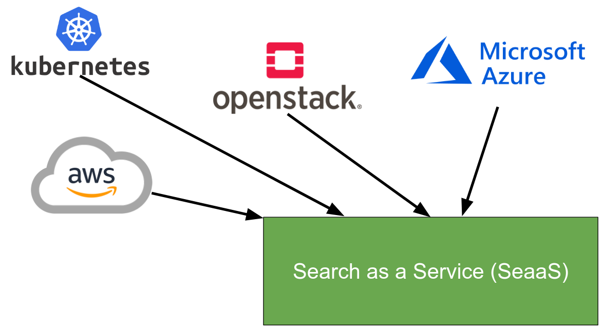

..
      Licensed under the Apache License, Version 2.0 (the "License"); you may
      not use this file except in compliance with the License. You may obtain
      a copy of the License at

          http://www.apache.org/licenses/LICENSE-2.0

      Unless required by applicable law or agreed to in writing, software
      distributed under the License is distributed on an "AS IS" BASIS, WITHOUT
      WARRANTIES OR CONDITIONS OF ANY KIND, either express or implied. See the
      License for the specific language governing permissions and limitations
      under the License.

Searchlight Team Vision
=======================

Searchlight was originally developed and released in the Kilo release of
Glance as the Catalog Index Service [#]_. At the Liberty Summit, we decided
to broaden the scope to provide advanced and scalable search across
multi-tenant cloud resources. And in the Stein cycle, we have developed a
grand vision for Searchlight to help sustain the project in alignment with
the OpenStack Cloud Vision [#]_.

Our Vision
----------

With the modular architecture of Searchlight and based on the discussions of
the Searchlight team, we envisioned making Searchlight a universal search
interface not only for OpenStack but also other cloud platforms such as
Microsoft Azure [#]_, AWS [#]_, or even Kubernetes [#]_, etc.. The final
product of this vision could be building a multi-cloud management application
and a unified API for multi-cloud resource discovery, which serves as a
cloud information base for automation application, e.g., VIM management,
NFV MANO. This requires new designs of additional data models, APIs,
communication, and features which are analyzed further in specific use
case analysis & design documents. References will be provided when available.

References
----------

.. [#] http://specs.openstack.org/openstack/glance-specs/specs/kilo/catalog-index-service.html
.. [#] https://governance.openstack.org/tc/reference/technical-vision.html
.. [#] https://storyboard.openstack.org/#!/story/2004718
.. [#] https://storyboard.openstack.org/#!/story/2004719
.. [#] https://storyboard.openstack.org/#!/story/2004382
